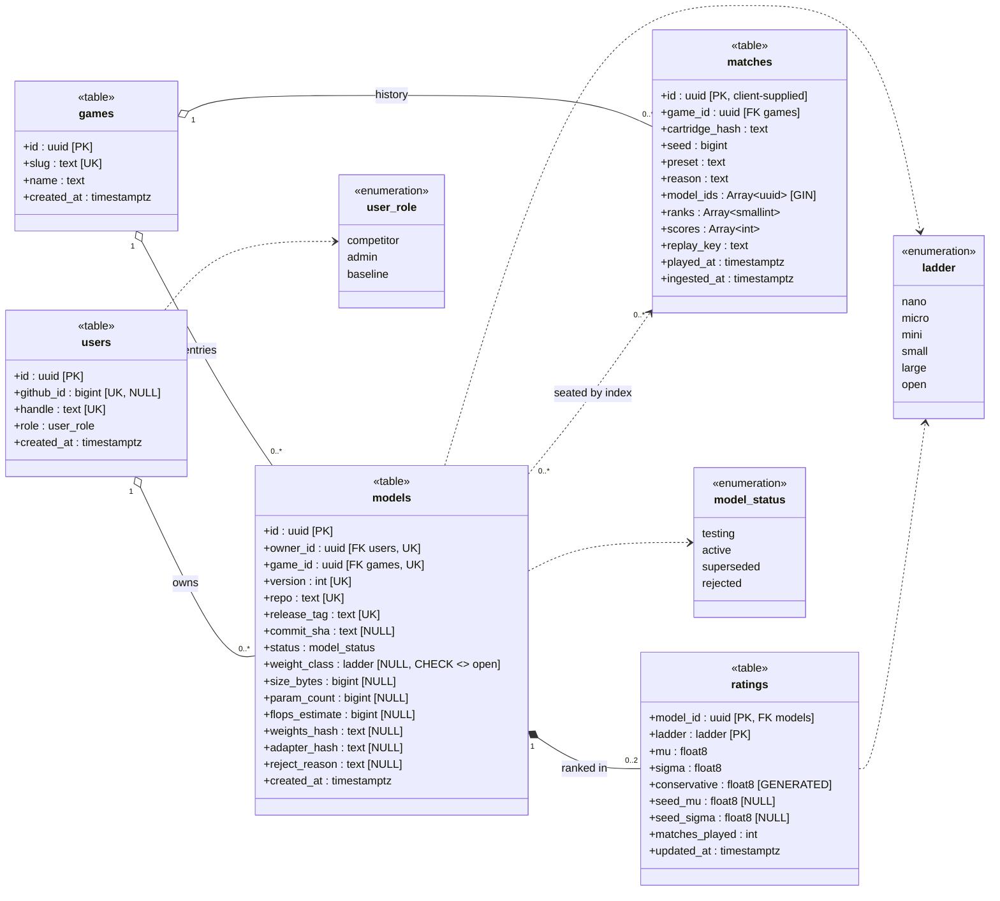

# Soma — M0 database schema

UML class diagram for the five tables in [`scope.md`](scope.md) §4. Postgres.

Every column here serves one of the eleven frontend endpoints or a rule stated in §5. Two
exceptions are named there rather than hidden.

Two services write this database. Soma owns `users` and inserts the `models` row; the game manager
owns `matches` and `ratings` and fills in everything a submission cannot know about itself. §5 says
why that is safe.

---

## 1. Diagram

Composition (`*--`) marks existence dependency and cascade delete: a rating cannot outlive its
model. Aggregation (`o--`) marks a reference that must survive the other side going away — deleting
a user must not erase the matches their model played, because those matches are other competitors'
rating history too.

---

## 2. Tables

### `games`
| Column | Type | Notes |
|---|---|---|
| `id` | uuid | PK |
| `slug` | text | unique — `'ants'`. The public identifier in every API path |
| `name` | text | display |
| `created_at` | timestamptz | |

**Four columns is the whole catalog.** Everything the old `servers` table held — capacity,
cartridge hash, registration time, heartbeat, lease — was runtime state about a fleet Soma does not
track and now does not talk to at all. What remains is a name and a slug.

### `users`
| Column | Type | Notes |
|---|---|---|
| `id` | uuid | PK |
| `github_id` | bigint | unique, **null for baselines**, the identity anchor for everyone else |
| `handle` | text | unique, displayed as the model owner |
| `role` | `user_role` | default `competitor` |
| `created_at` | timestamptz | |

No email, no avatar, no profile. Invite-only is enforced against a handle allowlist in config, so
there is no invitations table.

**Baselines are users.** A cartridge ships several reference opponents, and a model has no name —
it is displayed as its owner's handle and version. So the only way three baselines can be told
apart on a leaderboard is for each to *be* an owner: `baseline-random`, `baseline-greedy`,
`baseline-strong`, each with `role = baseline`. An admin uploads on their behalf; they never sign
in, which is why `github_id` is nullable. A `CHECK (role = 'baseline' OR github_id IS NOT NULL)`
keeps every human account anchored.

The payoff is that baselines need no special case anywhere else. They version, get admitted,
supersede and rate through exactly the same machinery as a competitor, and the one-active
constraint below applies to them unchanged — each baseline has one live version per game.

### `models`
| Column | Type | Notes |
|---|---|---|
| `id` | uuid | PK |
| `owner_id` | uuid | FK → `users` |
| `game_id` | uuid | FK → `games` |
| `version` | int | unique with `(owner_id, game_id)`; `max + 1` at submission |
| `repo` | text | `owner/name` on GitHub |
| `release_tag` | text | the release whose assets carry the weights and adapter |
| `commit_sha` | text | null until admission — what the tag actually resolved to |
| `status` | `model_status` | `testing` → `active` → `superseded`, or `testing` → `rejected` |
| `weight_class` | `ladder` | null until admission; `CHECK (weight_class <> 'open')` |
| `size_bytes` | bigint | null until admission. **The size metric** — compressed weights + compressed adapter |
| `param_count` | bigint | null until admission. Displayed, does not rank |
| `flops_estimate` | bigint | null until admission. For the deferred eligibility gate; never a ranking axis |
| `weights_hash` | text | null until admission. Content address; also the key the model manager loads by |
| `adapter_hash` | text | null until admission. Content address |
| `reject_reason` | text | null unless `status = rejected` |
| `created_at` | timestamptz | when this version was submitted, and when its admission clock starts |

**Everything below `status` is null at insert.** A submission names a GitHub release; it cannot
state its own size, class or hashes, because computing them means fetching and parsing an ONNX file
and Soma does neither. Those columns are filled by the game manager when it admits the model.
Nulls never reach a ladder — every index that serves one is `WHERE status = 'active'`, and a row
only becomes `active` once they are populated.

**One row per submission.** A competitor accumulates a row per version of their entry in a game;
only one of them contests at a time. There is no model name — a row is displayed as its owner's
handle and its version number.

Four constraints carry the whole rule:

| Constraint | Enforces |
|---|---|
| `UNIQUE (owner_id, game_id, version)` | versions are unambiguous per entry |
| `UNIQUE (owner_id, game_id) WHERE status = 'active'` | **at most one contesting version** |
| `UNIQUE (owner_id, game_id) WHERE status = 'testing'` | **at most one submission in flight** |
| `UNIQUE (owner_id, game_id, repo, release_tag)` | the same release cannot be entered twice |

The two partial unique indexes are what make "only one active" and "only one in flight" constraints
instead of conventions. Promotion is one transaction: demote the current `active` to `superseded`,
promote the `testing` row to `active`. Any interleaving that would leave two rows in either state
fails rather than corrupting the ladder.

The second index is what makes promotion *ordered*. Without it, two submissions could sit in
`testing` at once, finish admission out of order, and leave the older version active — atomic, and
still wrong. Serialising the queue to one is simpler than guarding the promote statement with a
version comparison, and it is the rule a competitor can actually hold in their head: **one at a
time**. A submission arriving while another is testing is refused at the API with `409`, before a
row is written, so a double-click costs no version number.

That refusal introduces the one new failure mode worth naming: a `testing` row that never reaches a
terminal state locks its owner out forever. There is no worker at M0, so the sweep is lazy — on the
next submission, a `testing` row older than the admission timeout is marked `rejected` with reason
`admission_timeout` and the new submission proceeds. `created_at` already dates it, so this costs
no column.

`version` is `MAX(version) + 1` per `(owner_id, game_id)`, computed at insert. Rejected submissions
consume version numbers, so versions are monotonic but not dense — which means **the predecessor of
a version is not `version - 1`**. It is the highest version below it with status `superseded`,
since `superseded` is reachable only from `active`. That chain is the lineage, and it is why no
`parent_id` column exists.

Blobs are not in the database, and they do not pass through Soma either. A submission is a
reference to a GitHub release; the hashes are recorded after something else has fetched it.

### `ratings`
| Column | Type | Notes |
|---|---|---|
| `model_id` | uuid | PK with `ladder`, FK → `models`, cascade delete |
| `ladder` | `ladder` | PK — either the model's own `weight_class`, or `open` |
| `mu` | float8 | TrueSkill mean |
| `sigma` | float8 | TrueSkill deviation |
| `conservative` | float8 | **generated**: `mu - 3*sigma`. What the leaderboard sorts on |
| `seed_mu` | float8 | the predecessor's `mu` at the moment this version was promoted; null if none |
| `seed_sigma` | float8 | the inflated `sigma` this version started from; null if none |
| `matches_played` | int | per ladder — `provisional` is derived from this, not stored |
| `updated_at` | timestamptz | |

**Two rows per promoted model** — one for its weight class, one for `open`. See §3.

Rows are created at promotion, not at insert, so a `testing` or `rejected` model has none. That is
why the diagram says `0..2` and why `GET /models/{id}` must left-join.

`seed_mu` and `seed_sigma` exist so that ratings stay reconstructible. A promoted version inherits
its predecessor's rating with `sigma` inflated, and that inherited value is taken at a single
instant — but the predecessor keeps rating after it is superseded, because matches already in
flight on the fleet finish and post results. So the predecessor's *final* `mu` is not the value its
successor started from, and no amount of replaying `matches` in order recovers the difference.
Recording the seed makes the rating a pure function of the log plus two stored numbers. Without it,
the ladder is unauditable the first time anyone asks why a version scored what it did.

### `matches`
| Column | Type | Notes |
|---|---|---|
| `id` | uuid | PK, **supplied by the game server** |
| `game_id` | uuid | FK → `games` |
| `cartridge_hash` | text | which engine version played it — required to re-simulate the replay |
| `seed` | bigint | |
| `preset` | text | requested by name, meaning never inspected |
| `reason` | text | **free text, never an enum** — the end reason is game-defined |
| `model_ids` | uuid[] | seat `i` was played by `model_ids[i]` — a version-specific id |
| `ranks` | smallint[] | 1 = best; ties allowed |
| `scores` | int[] | integer by law — game state carries no floats |
| `replay_key` | text | object-storage key |
| `played_at` | timestamptz | reported by the game server |
| `ingested_at` | timestamptz | `default now()` — Soma's clock, and the ordering key for any recompute |

**The three seat arrays are positionally aligned** — index *is* seat number, the same addressing
`docs/PROTOCOL.md` uses for actions against ants. A `CHECK` keeps their lengths equal.

There is no `ladder` column. Which ladders a match feeds is derived from its participants: every
match counts toward `open`, and a match whose seats all share one `weight_class` also counts toward
that class ladder. See §3.

---

## 3. Ladders

A model competes in exactly two ladders: **its own weight class**, and **open**, where size is not
classified at all. Both are per game. This is why `ratings` is keyed on `(model_id, ladder)` rather
than on `model_id` alone — one rating per model could only ever describe one of the two.

**`open` is no longer a weight class.** It used to name the largest size bucket, and it cannot mean
both "≤ 64 MiB" and "any size" — a 40 MiB model would need two rating rows with the same key. The
top bucket is now `large`, and `open` is reserved for the unclassified ladder. One enum covers both
roles, and `models.weight_class` carries a `CHECK (weight_class <> 'open')` so a model can never be
*assigned* to the ladder every model already plays in.

**Which ladder a match counts for is derived, not declared.** Every match updates the `open`
ratings of its participants. A match whose seats all share a weight class *also* updates that
class's ratings. So a class ladder is built only from same-size games, which is what a weight class
means, while `open` accumulates every game played on the platform.

The alternative — a `matches.ladder` column the game server sets — was rejected because it makes an
all-micro match ambiguous (a micro-ladder match, or an open-ladder match that happened to draw two
micros?) and because it throws away data: under a declared ladder, every class match is wasted on
`open`. Deriving it dissolves the ambiguity, since the answer is *both*, and gives the open ladder
the most data of any ladder on the platform.

The cost is a fleet obligation rather than a schema one: **the open ladder is only meaningful if
the matchmaker schedules cross-class matches.** If every match were same-class, `open` would be a
union of disconnected TrueSkill graphs and a nano rating would not be comparable to a large one.
A reserved fraction of mixed-size matches is a policy value (S13), and until S13 exists it is a
constant in fleet config.

**Seeding happens per ladder.** On promotion, each of the two rows seeds from the predecessor's row
in the *same* ladder. If a new version changes weight class — a competitor shrinks a micro entry
into nano — its `open` rating seeds normally, and its `nano` rating has no predecessor and starts
at the TrueSkill prior with `seed_mu` null. Changing class is a genuine restart on the class
ladder, which is correct: it has not beaten anyone there.

---

## 4. Indexes

Seven — three serving an endpoint, three enforcing a rule, one doing both.

| Index | Serves |
|---|---|
| `games (slug)` unique | resolves every slug-addressed path to a `game_id` |
| `models (owner_id, game_id, version)` unique | `GET /models?owner=me`, and version uniqueness |
| `models (owner_id, game_id) WHERE status='active'` unique | the one-active-version constraint |
| `models (owner_id, game_id) WHERE status='testing'` unique | the one-in-flight constraint |
| `models (owner_id, game_id, repo, release_tag)` unique | the no-duplicate-release constraint |
| `models (game_id, weight_class) WHERE status='active'` | class ladders, and — on its `game_id` prefix — the open ladder |
| `matches` GIN on `model_ids` | `GET /matches?model={id}` — containment, not a join |

`ratings` needs no index beyond its primary key: every read reaches it by `(model_id, ladder)` from
a model already selected.

**There is deliberately no index on `conservative`.** One would look right and never be used. Only
`active` models are ranked, `status` lives on `models`, and Postgres cannot build a partial index
across a join — so an index on `ratings (conservative DESC)` would have to be walked past every
superseded and rejected version, which after a few weeks of iteration is most of the table. The
leaderboard is therefore a join filtered by the partial index above, sorted afterward. At M0 that
sorts one row per competitor per ladder — hundreds — which is free, and platform.md's S8 projection
tier is the deferred answer for when it stops being.

Two consequences worth stating rather than discovering. Cursor pagination sorts on a column in the
joined table, so `next_cursor` must encode `(conservative, model_id)` and compare row-wise.
And `ratings` grows with every version ever submitted while only active ones are ever ranked —
the first table that will want partitioning.

---

## 5. Decisions worth stating

**`models` has two writers, and that is only safe because the rules are constraints.** Soma inserts
the `testing` row; the game manager fills the admission columns and moves the status. This breaks
`../platform.md` §5's one-writer-per-store invariant deliberately, and what makes it hold together
is that neither service is trusted to enforce "one active version" or "one in flight" — the
database is. Both are partial unique indexes, so a race between two independent services fails an
insert rather than corrupting a ladder. Writing those rules as constraints was worth doing when one
service owned this table; with two, it is the only reason the split is tolerable.

**`ratings` is a separate table, not columns on `models`.** `models` is written once and read
constantly; `ratings` is written on every single match, twice. Splitting them keeps the hot write
off the wide row — and once a model has two ratings, the split is no longer a preference.

**`conservative` is a generated column.** The leaderboard sorts on `mu - 3*sigma`; materializing it
keeps that expression out of every query and every ORDER BY.

**No `parent_id` on `models`.** Versions are monotonic per `(owner_id, game_id)`, and `superseded`
is reachable only from `active`, so the predecessor is the highest superseded version below this
one. A column would store what the key already determines. The *seed values* are a different fact
and are stored, because they record a moment rather than a relationship — see `ratings` above.

**`matches.id` is supplied by the game server.** Result ingest is idempotent on `match_id`, which
only works if the server owns the identifier — an insert that conflicts is a duplicate delivery
and can be dropped without a lookup.

**`matches` carries both a played and an ingested timestamp.** `played_at` comes from a game server
whose clock Soma does not control, and it is the only thing that could order a rating recompute.
A skewed or reset clock would silently reorder history. `ingested_at` is Soma's own clock, is
monotonic under its own writes, and is what a recompute walks; `played_at` is what the UI shows.

**`matches.reason` is text, never an enum.** The end reason comes from the cartridge and is
game-specific. Enumerating it in the schema would be Soma parsing game semantics, which
[`../platform.md`](../platform.md) §5 forbids.

**A row per version is what makes a `testing` state safe.** When a submission overwrote the live
entry, a broken submission could knock a competitor off the ladder, which forced admission to run
*before* the write. A new version is now a new row that nothing depends on yet, so it can be written
first and tested after — the live version keeps contesting throughout, and a rejection is a row the
competitor can read rather than an error they have to remember. This is also the seam that lets
trial matches land later without restructuring: `testing` simply takes longer and stays observable.

**A promoted version seeds its rating from the one it replaces, per ladder.** Starting each version
at the TrueSkill prior would cost a full re-convergence on every submission, punishing in a
competition whose entire loop is iterating on weights, and would park every new submission at the
bottom of the ladder until it played its way back. Carrying the rating unchanged would let a good
v3 vouch for a mediocre v4. Seeding `mu` from the previous version with `sigma` inflated is
TrueSkill's own answer to an uncertain competitor, and because the previous version keeps its own
rows, the seed costs no history.

**`matches` does not store a seat's version or its ladder.** The first is carried by the
version-specific `model_id`; the second is derivable from the participants' classes (§3). Both
would be duplicating a fact the row already determines.

**Seats are arrays on `matches`, not rows in a join table.** A match is written once, read whole,
and never partially updated, so the join table bought normalization the workload never used. Three
costs come with the merge and none is hidden: Postgres cannot foreign-key an array element, so
nothing at the database level stops a match referencing a model that does not exist or one from
another game — ingest must check both; a competitor's match history becomes a GIN containment scan
that sorts after the fact rather than walking an index, which is the one that will complain first
at scale; and because arrays cannot cascade, **deleting a user is not actually available** — every
match they appear in would render a dangling seat. Soft-delete is the only option that keeps match
history intact, which settles what used to be an open decision.

**`matches.cartridge_hash` survives the cull, and is deliberately not a foreign key.** It is not a
derived field — it records what *actually ran*, and nothing else in the database can reconstruct it.
A replay must re-simulate with the engine that produced it, so the first cartridge upgrade would
silently corrupt every replay older than it if this were dropped or resolved through a mutable
catalog row. Together with `seed` and `preset` it is the reproducibility triple: given the action
stream, those three replay the match exactly.

**No fleet state, and no fleet surface.** Soma cannot tell whether a game server is alive and does
not need to: the game manager writes `matches` and `ratings` itself, so a dead fleet is visible as a
ladder that stopped moving. There is no roster call, no result ingest and no heartbeat to
authenticate, which removes the shared secret M0 would otherwise have needed.

**The slug stays the public identifier.** API paths remain `/games/ants/leaderboard` and the
cartridge manifest still names itself `"game": "ants"`, so nothing outside the database
learns the uuid. `games.slug` is unique, and resolving it costs one index hit on a table small enough
to stay permanently cached.

**`weight_class`, not `class`.** `class` is a reserved word in enough SQL dialects and ORMs to be
a recurring annoyance. The API exposes the ladder as `ladder`, which now covers both meanings.

**`param_count` and `flops_estimate` are the two columns that serve no M0 endpoint.** Neither
appears in a response shape, and the FLOP gate needs per-class caps from the cartridge manifest,
which is not in the database. They are recorded at admission because they are cheap to compute then
and impossible to backfill for models already submitted. Deleting them is a two-line change if that
trade reads differently.

---

## 6. What the deferred modules add later

| Deferred | Schema change |
|---|---|
| Seasons (S9) | `seasons` table; `ratings` re-keyed on `(model_id, ladder, season_id)`; `matches.season_id` |
| Pareto frontier | none — a read projection over `size_bytes` × `conservative` on the `open` ladder, already stored |
| Quotas (S3) | `quota_counters (user_id, window, count)` |
| Policy (S13) | `policies (version, body, activated_at)` — including the cross-class match fraction §3 needs |
| Audit (S17) | `audit_log`, append-only |
| Commands (S11) | `commands (server_id, verb, issued_at, acked_at)` |
| Strikes / forfeits | `matches.strikes smallint[]`, a fourth seat array |
| Trial matches (S4) | none — `testing` already exists and is already observable; it just takes longer |
| Stale-admission sweep as a job | none — the lazy sweep on next submission becomes a cron over `created_at` |
| Pulling a live entry off the ladder | `model_status` gains `retired`, distinct from `superseded` |
| Cartridge versioning | `cartridges (game_id, version, hash, abi, published_at)`; `matches.cartridge_hash` becomes an FK |
| More than one server per game | `servers (game_id, cartridge_hash, capacity, lease_expires_at)` returns; `matches.server_id` |
| Referential integrity on seats | `match_players` returns as a join table, once bad refs or history queries justify it |
| Per-game ladder config | `games.player_counts`, `games.classes` return, once a second game disagrees with the first |
| Leaderboard at scale | S8 projection table of active models only, which is the one place a `conservative` index earns itself |

The frontier costing nothing is the point: M0 already records both of its axes on the ladder where
every model meets every other one, so the headline feature of the competition is a query away
rather than a migration away.

---

## 7. Open decisions

1. **Seat arrays vs. one `jsonb players` column.** Three typed arrays keep uuid and smallint types
   and give a clean GIN containment query; a single jsonb column is one insert parameter and cannot
   drift in length. Judgment call, cheap to flip.
2. **Which release assets are canonical** — fixed names (`model.onnx`, `adapter.json`) or named
   in the release body. Soma stores the reference and never opens it, so this is the game manager's
   contract, but it is the part a competitor has to be told, and it belongs in the published rules
   rather than in one service's source.
3. **Whether the seed is worth its two columns at all.** If the fleet plays continuously, TrueSkill
   converges in tens of matches — minutes, not days — and starting every version at the prior would
   make ratings a pure function of `matches` with nothing else to record. The seed exists to keep a
   new version from visibly bottoming out while it re-converges. That is a UX judgment about how
   fast the fleet actually is, and it is the cheapest thing here to remove if the answer is "fast".
4. **Sigma inflation on promotion** — how much, and whether the same amount is right for both
   ladders when they converge at different rates.
5. **Whether baselines appear on the leaderboard** or are filtered to a reference line. `role`
   makes it a display decision either way; it does not change the schema.
6. **`rank` ties** — Ants can draw. Confirm whether ranks are dense (`1,1,3`) or competition-style,
   since TrueSkill's update depends on it.
7. **Rating history within a version** — ratings are per version and per ladder, so a competitor's
   progress *across* submissions is recorded. Movement *within* one version's life is not, and a
   rating-over-time chart stays unavailable for matches played before a history table exists.
   Cheap to add now, impossible to backfill.
8. **Pruning old versions** — rows accumulate one `models` row and two `ratings` rows per
   submission forever, each pinning a weights blob in the artifact store. Whether old versions keep
   their blobs or only their metadata is a storage-cost decision, not a schema one.
